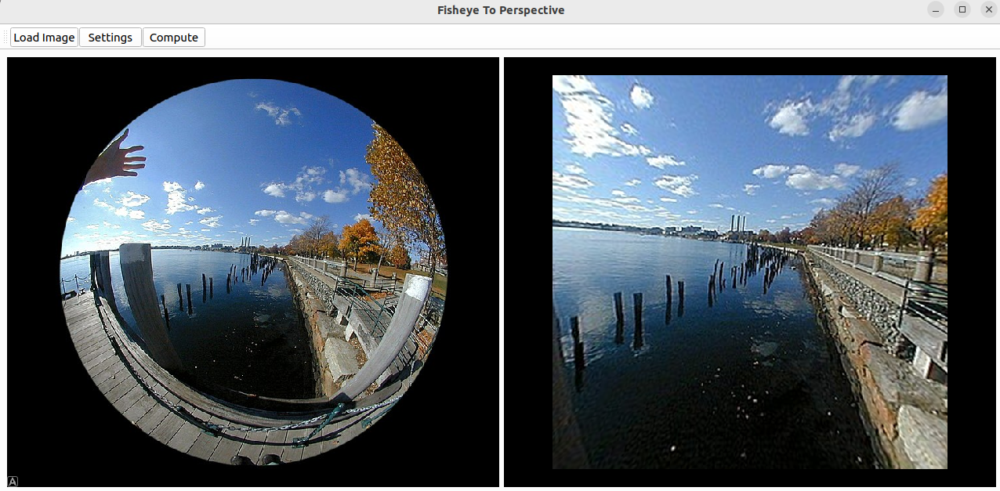

# fisheye-tool
Fisheye lenses are used to capture a wide field of view. However, the images captured by fisheye lenses are distorted.
This tool can be used to convert fisheye images to perspective images. It can be used as:

- A command line tool
- A python library
- a GUI tool

## Table of Contents

- [Overview](#overview)
  * [Fisheye projection models](#fisheye-projection-models)
    + [Equidistant Projection](#equidistant-projection)
    + [Equal-area Projection](#equal-area-projection)
    + [Orthographic Projection](#orthographic-projection)
    + [Stereographic Projection](#stereographic-projection)
  * [Fisheye Lens Types](#fisheye-lens-types)
    + [Circular Fisheye Lens](#circular-fisheye-lens)
    + [Diagonal (Full-frame) Fisheye Lens](#diagonal--full-frame--fisheye-lens)
- [Installation](#installation)
- [Usage](#usage)
  * [Command line tool](#command-line-tool)
  * [Python library](#python-library)
  * [GUI tool](#gui-tool)
- [Examples](#examples)
- [License](#license)
- [References](#references)

## Overview
A fisheye lens is a type of ultra-wide-angle lens that captures images with an expansive
field of view, often 180 degrees or more. It creates a distinctive distortion, where
straight lines become curved, particularly near the edges of the image. Unlike standard
lenses that maintain straight lines (rectilinear projection), fisheye lenses use a unique
mapping technique that results in a convex, non-rectilinear appearance.


*Figure 1: Principles of different lens. (a) the projections of different lens, p, p1, p2, p3 and p4 are perspective projection, stereographic projection, equidistance projection, equisolid angle projection and orthogonal projection, r, r1, r2, r3 and r4 are their corresponding distances between the image points and principal point; (b) difference between pinhole lens and fisheye lens. For fisheye lens, the actual image is the projection of perspective image on hemisphere surface to image plane.*

Source: [Original Source](https://opg.optica.org/oe/fulltext.cfm?uri=oe-20-20-22252&id=241445)
### Fisheye projection models

Pinhole projection preserves the rectilinearity of the projected scene, meaning straight lines in the scene remain straight on the image plane. The Pinhole projection mapping function is given by:

$$ r = f \cdot \tan(\theta) $$

Where:
- `f` is the distance between the principal point and the image plane.
- `θ` is the incident angle (in radians) of the projected ray to the optical axis of the camera.
- `r` is the distance between the principal point and the image point.

This model results in evenly spaced image points for angular spacing in the scene, but may result in significant distortion at the edges.

Fisheye lenses use different projection models to map the scene onto the image plane. Below are the common projection models used in fisheye lenses, along with their corresponding equations.

#### **Equidistant Projection**

The equidistant projection ensures that the distance between the principal point and the image point is proportional to the angle between the optical axis and the projected ray.

$$ r = f \cdot \theta $$

This projection model is often used in fisheye lenses due to its simplicity and ability to maintain the angular relationships between points in the scene. However, it may result in some distortion in terms of shapes and angles.


#### **Equal-area Projection**

The equal-area projection ensures that equal areas in the scene are mapped to equal areas on the image. This is often used in scientific and astronomical applications.

$$ r = 2f \cdot \sin\left(\frac{\theta}{2}\right) $$

This projection minimizes the distortion in terms of area, ensuring that objects maintain their relative sizes, though shapes and angles might still be distorted.

#### **Orthographic Projection**

In orthographic projection, the fisheye lens maps a hemisphere onto a circle. This projection is often used for artistic purposes.

$$ r = f \cdot \sin(\theta) $$

This model creates more natural, less distorted-looking images at the center but compresses the edges more than other models.

#### **Stereographic Projection**

The stereographic projection preserves angles and is often used for artistic or cartographic representations. In this model, circles in the scene are mapped as circles in the image.

$$ r = 2f \cdot \tan\left(\frac{\theta}{2}\right) $$

This projection is widely used in panoramic and wide-angle photography due to its ability to preserve shapes.

### Fisheye Lens Types

Fisheye lenses come in two main types, each with distinct characteristics based on how the image circle interacts with the sensor or film area.

#### **Circular Fisheye Lens**

In a circular fisheye lens, the image circle is fully inscribed within the film or sensor area, meaning the resulting image appears circular with black edges around it. This lens captures a 180-degree field of view or more, but only in the circular area of the sensor.

#### **Diagonal (Full-frame) Fisheye Lens**

In a diagonal (also known as "full-frame") fisheye lens, the image circle is circumscribed around the film or sensor area. This means that the fisheye effect spans the entire frame, with the image extending to the edges of the sensor. The diagonal fisheye still provides a wide field of view, but unlike circular fisheye lenses, it fills the whole frame.


## Installation

First clone the repo:
```bash
git clone git@github.com:TerboucheHacene/fisheye-tool.git
cd fisheye-tool
```

To install the dependencies, you need to use poetry. If you don't have it installed, you can install it using the following command:
```bash
pip install poetry
```

Then, you can install the dependencies using the following command:
```bash
poetry install
```

This will install all the dependencies needed for the project (including the dev, docs and tests dependencies). If you want to install only the dependencies needed for the project, you can use the following command:
```bash
poetry install --only main
```
To run the main script, you can use the following command:
```bash
poetry run python scripts/main.py
```


## Usage
### Command line tool
The command line tool can be used to convert fisheye images to perspective images. The tool takes the following arguments:

- input_file: The path to the input fisheye image file.
- output_file: The path to save the output perspective image file.

The tool also supports the following optional arguments:

- `--fov`: The field of view (in degrees) of the fisheye lens. Default is 180 degrees.
- `--perspective_fov`: The field of view (in degrees) of the perspective image. Default is 120 degrees.
- `--camera_type`: The type of projection model used by the fisheye lens. Options are 'equidistant', 'equal-area', 'orthographic', 'stereographic'. Default is 'equidistant'.
- `--format`: The format of the fishery image. Options are 'circular', 'diagonal'. Default is 'circular'.


### Python library
The python library can be used to convert fisheye images to perspective images programmatically. The library provides a `FisheyeToPerspective` class that can be used to perform the conversion. The class takes the following parameters:

```python
from fisheye.projection import FisheyeToPerspective
from fisheye.schemas import CameraType, FisheyeFormat

fisheye_converter = FisheyeToPerspective(
    input_file='path/to/input/fisheye/image.jpg',
    fov=180,
    perspective_fov=120,
    camera_type=CameraType.EQUIDISTANT,
    fisheye_format=FisheyeFormat.CIRCULAR
)
image = fisheye_converter(output_file='path/to/output/perspective/image.jpg')
```

### GUI tool

The GUI tool provides a user-friendly interface for converting fisheye images to perspective images. The tool allows users to select the input fisheye image file, set the field of view, perspective field of view, camera type, and fisheye format, and compute the perspective image. To launch the GUI tool, you can use the following command:

```bash
poetry run python src/fisheye/app.py
```



## Examples
You can find an example of fisheye image in the `data` folder downloaded from [here](https://fr.m.wikipedia.org/wiki/Fichier:Fisheye_photo.jpg). You can use any method to convert the fisheye image to perspective image.
Here are the results of the conversion using the different projection models:

<table>
  <tr>
    <td>
      
      <p>Equidistant Projection</p>
    </td>
    <td>
      
      <p>Equal-area Projection</p>
    </td>
  </tr>
  <tr>
    <td>
      
      <p>Orthographic Projection</p>
    </td>
    <td>
      
      <p>Stereographic Projection</p>
    </td>
  </tr>
</table>


## License
This project is licensed under the Apache License, Version 2.0 - see the [LICENSE](LICENSE) file for details.


## References

- [Fisheye Lens - Wikipedia](https://en.wikipedia.org/wiki/Fisheye_lens)
- [Fisheye Projection Models - Optics Express](https://opg.optica.org/oe/fulltext.cfm?uri=oe-20-20-22252&id=241445)
- [Fisheye Projection Models - OpenCV](https://docs.opencv.org/4.x/db/d58/group__calib3d__fisheye.html)
- [Fisheye Projection Models - OpenCV Python](https://docs.opencv.org/4.x/d9/d0c/group__calib3d.html)
